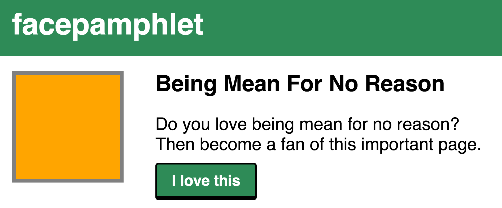
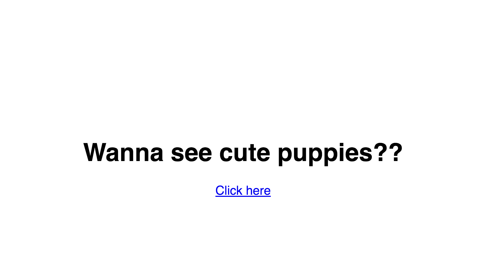

Brevemente: *Frameguard* mitiga la posibilidad de ataques basados en "*clickjacking*" (robo de clicks) mediante el seteo de la cabecera `X-Frame-Options`.

El ataque
----------

 [Los ataques basados en Clickjacking](https://en.wikipedia.org/wiki/Clickjacking) pueden ser bastánte astutos.

El atacante intentará que hagas *click* donde no tienes planeado hacerlo. Para lograrlo, esconderán el botón o enlace detrás de un señuelo montado para hacerte creer que estás haciendo *click* donde realmente deseas hacerlo.

Imaginemos que poseo una red social llamada "*Facepamphlet*" y estoy intentando que hagas *clicl* en *"I love this"* en el apartado, "*Being mean for no reason*".



¡Probablemente Nunca harías click en el botón "*I love this*" porque eres una persona amable y no eres una persona que desea ser malo sin motivo!
*[N.de.T: "Being mean for reason" significa "Ser malo sin ningún motivo"]*.

Pero digamos que te envío a un sitio en el cual prometen cientos de fotos de cachorritos adorables. ¡Vamos, claro que harías *click* para ver eso! ¡Los cachorritos son hermosos!

Entonces te mando una página que luce como la siguiente:



Como estás dispuesto a ver esos hermosos cachorritos decides hacer *click* donde dice "*Click here*". Pero, sin saberlo, hay un *iframe* invisible justo en el mismo lugar donde acabas de hacer *click*.


Acabo de robarte el click ("*clickjacked*"), y logré que hicieras *click*  en "*I love this*" en aquella página que intentaste evitar.

El robo de *clicks* ("*Clickjacking*") puede ser usado para hacerte *clickear* en lugares que no quieres hacerlo. Estos ataques pueden inducirte a hacer *click* en botones dentro de redes sociales, propagandas, e incluso lograr engañarte para hacer cosas más complejas.

Para más información:

- [Clickjacking article on Wikipedia](https://en.wikipedia.org/wiki/Clickjacking)
- [Clickjacking Defense Cheat Sheet](https://www.owasp.org/index.php/Clickjacking_Defense_Cheat_Sheet)
- [iframe element](https://developer.mozilla.org/en-US/docs/Web/HTML/Element/iframe)

La cabecera
----------

La cabecera `X-Frame-Options` le indica a los navegadores que impida poner tu página dentro de un *iframe* ubicado en el contenido de otro sitio. Cuando los navegadores cargan *iframes* primero se fijarán en el valor de la cabecera `X-Frame-Options` y abortarán la carga si ésta no está permitida.

La cabecera posee tres opciones:

1. `X-Frame-Options: DENY` impedirá que nadie ponga tu página en un *iframe*.
2. `X-Frame-Options: SAMEORIGIN` impedirá que nadie ponga tu página en un *iframe* a **excepto que sea del mismo origen**. Esto generalmente significa que tú puedes poner tus propias páginas en *iframes* pero nadie más puede hacerlo.
3. `X-Frame-Options: ALLOW-FROM http://example.com` permitirá que `http://example.com` ponga tu página dentro de un *iframe*, pero nadie más. (Desafortunadamente los navegadores no soportan bien ésta funcionalidad y sólo puedes añadir un sólo dominio).

En el ejemplo anterior, *"Facepamphlet*" podría mitigar el robo de clicks ("*clickjacking*") asignando la cabecera `X-Frame-Options` a `DENY`, previniendo así que sus propias páginas sean puestas dentro de *iframes*. Muchos sitios de internet hacen ésto mismo.

Si en realidad no estás esperando que tu página sea puesta en un *iframe*, siempre es buena idea asignar ésta cabecera en `DENY` o `SAMEORIGIN` dado que ésto limita posibles ataques.

Ésta cabecera tiene un muy buen soporte: IE8+, Opera 10.50+, Safari 4+, Chrome 4.1+, y Firefox 3.6.9+. Pero la opción `ALLOW-FROM` [no está soportada de la misma forma](https://developer.mozilla.org/en-US/docs/Web/HTTP/X-Frame-Options#Browser_compatibility). Aquellos navegadores que no soporten dicha opción ignorarán la cabecera por completo [y el *iframe* **sí** será renderizado](https://www.owasp.org/index.php/Clickjacking_Defense_Cheat_Sheet#Limitations_2), por lo que quizás deberías evitar usar ésta opción.

Para más información:

- [MDN](https://developer.mozilla.org/en-US/docs/Web/HTTP/X-Frame-Options)
- [Can I Use X-Frame-Options](http://caniuse.com/#feat=x-frame-options)
- ["Google YOLO"](https://blog.innerht.ml/google-yolo/)

El código
--------

La función Frameguard de Helmet es un middleware relativamente sencillo que setea la cabecera `X-Frame-Options` a lo que tú especifiques.

Puedes utilizar éste módulo como parte de Helmet:

```javascript
// Asegúrate de haber ejecutado "npm install helmet" para obtener el paquete de Helmet.
const helmet = require('helmet')

app.use(helmet.frameguard({ action: 'sameorigin' }))
```

También puedes usar éste módulo en solitario:

```javascript
// Asegúrate de haber ejecutado  "npm install frameguard" para obtener el paquete de Frameguard.
const frameguard = require('frameguard')

app.use(frameguard({ action: 'deny' }))
```

Una vez requerido puedes utilizarlo en tus aplicaciones:

```javascript
// Impide ser puesto en cualquier iframe.
// Sets "X-Frame-Options: DENY".
app.use(frameguard({ action: 'deny' }))

// Solo permite ser puesto en iframes del mismo origen.
// Sets "X-Frame-Options: SAMEORIGIN".
app.use(frameguard({ action: 'sameorigin' }))
app.use(frameguard())  // defaults to sameorigin

// Solo permite que un host incluya mis páginas en un iframe.
// Sets "X-Frame-Options: ALLOW-FROM http://example.com".
// RECUERDA QUE NO TODOS LOS BROWSER SOPORTAN ESTO!
app.use(frameguard({
  action: 'allow-from',
  domain: 'http://example.com'
}))
```

Ésta cabecera está incluida por defecto en el paquete de Helmet y está asignada con el valor de `SAMEORIGIN`.
